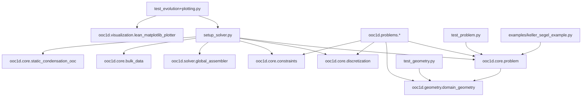
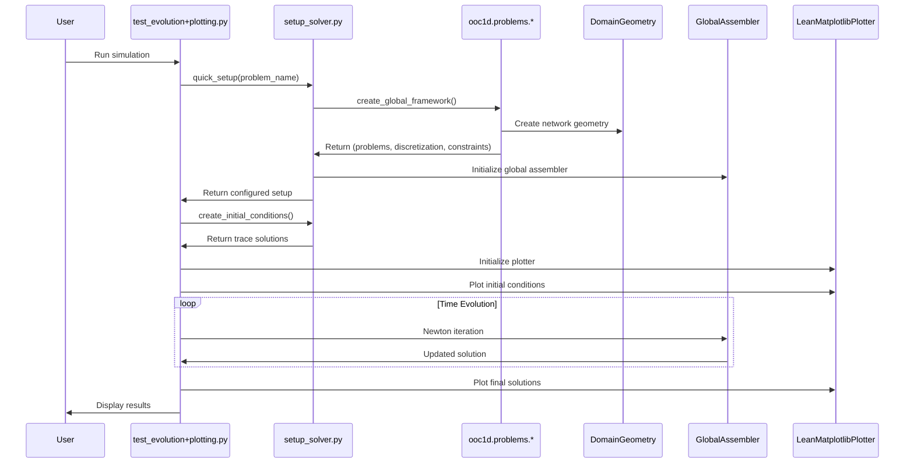

# BioNetFlux Code Structure Schematic

```
BioNetFlux/
├── 📁 code/                           # Main source code directory
│   ├── 📁 ooc1d/                      # Core framework modules
│   │   ├── 📁 core/                   # Core mathematical components
│   │   │   ├── 📄 __init__.py
│   │   │   ├── 📄 problem.py          # Problem definition class
│   │   │   ├── 📄 discretization.py  # Spatial discretization (FEM)
│   │   │   ├── 📄 constraints.py     # Boundary/interface constraints
│   │   │   ├── 📄 static_condensation_ooc.py  # Static condensation
│   │   │   └── 📄 bulk_data.py        # Bulk solution management
│   │   │
│   │   ├── 📁 geometry/               # Geometry management
│   │   │   ├── 📄 __init__.py
│   │   │   └── 📄 domain_geometry.py  # Multi-domain geometry class
│   │   │
│   │   ├── 📁 problems/               # Problem definitions
│   │   │   ├── 📄 __init__.py
│   │   │   ├── 📄 ooc_test_problem.py        # Basic OoC test case
│   │   │   ├── 📄 KS_traveling_wave.py       # Keller-Segel analytical
│   │   │   ├── 📄 T_junction.py              # T-junction geometry
│   │   │   ├── 📄 KS_with_geometry.py        # KS with geometry class
│   │   │   ├── 📄 KS_grid_geometry.py        # KS on grid network
│   │   │   └── 📄 OoC_grid_geometry.py       # OoC on grid network
│   │   │
│   │   ├── 📁 solver/                 # Numerical solvers
│   │   │   ├── 📄 __init__.py
│   │   │   ├── 📄 global_assembler.py        # Global system assembly
│   │   │   ├── 📄 newton_solver.py           # Newton-Raphson solver
│   │   │   └── 📄 time_integrator.py         # Time stepping
│   │   │
│   │   └── 📁 visualization/          # Plotting and visualization
│   │       ├── 📄 __init__.py
│   │       └── 📄 lean_matplotlib_plotter.py # Multi-mode plotter
│   │
│   ├── 📄 setup_solver.py             # Main solver setup interface
│   ├── 📄 test_evolution+plotting.py  # Main test/demo script
│   ├── 📄 test_geometry.py            # Geometry module tests
│   └── 📄 test_problem.py             # Problem module tests
│
├── 📁 examples/                       # Example applications
│   └── 📄 keller_segel_example.py     # Basic KS example
│
├── 📁 docs/                           # Documentation
│   ├── 📄 BioNetFlux_Documentation.md     # Main documentation (Markdown)
│   ├── 📄 BioNetFlux_Documentation.tex    # Main documentation (LaTeX)
│   ├── 📄 Mathematical_Background.md      # Mathematical theory (Markdown)
│   ├── 📄 Mathematical_Background.tex     # Mathematical theory (LaTeX)
│   ├── 📄 Code_Structure_Schematic.md     # This file
│   ├── 📄 compile_documentation.sh        # LaTeX compilation script
│   └── 📄 README_latex.md                 # LaTeX compilation guide
│
├── 📁 Logos/                          # Brand assets
│   ├── 🖼️ BioNetFlux.png              # Main logo
│   └── 🖼️ Barra.png                   # Institution bar
│
├── 📄 README.md                       # Project overview
└── 📄 .gitignore                      # Git ignore rules
```

## Module Dependencies and Data Flow



## Key Components Overview

### 🏗️ Core Architecture (`ooc1d/core/`)

| Component | Purpose | Key Classes/Functions |
|-----------|---------|----------------------|
| `problem.py` | Problem definition and physics | `Problem` class with validation |
| `discretization.py` | Finite element discretization | `Discretization`, `GlobalDiscretization` |
| `constraints.py` | Boundary/interface conditions | `ConstraintManager` |
| `static_condensation_ooc.py` | Element-level condensation | Static condensation algorithms |
| `bulk_data.py` | Bulk solution management | `BulkData`, `BulkDataManager` |

### 🗺️ Geometry System (`ooc1d/geometry/`)

| Component | Purpose | Key Features |
|-----------|---------|-------------|
| `domain_geometry.py` | Multi-domain network definition | `DomainGeometry`, `DomainInfo` classes |
| | | Intersection detection, connectivity analysis |
| | | Parameter space management, validation |

### 🧮 Solver Framework (`ooc1d/solver/`)

| Component | Purpose | Integration |
|-----------|---------|------------|
| `global_assembler.py` | System matrix assembly | Combines all domains |
| `newton_solver.py` | Nonlinear solver | Newton-Raphson iteration |
| `time_integrator.py` | Time stepping | Implicit time integration |

### 📊 Visualization (`ooc1d/visualization/`)

| Component | Visualization Modes | Use Cases |
|-----------|-------------------|-----------|
| `lean_matplotlib_plotter.py` | 2D curves (per domain) | Solution profiles |
| | Flat 3D view | Network topology with solutions |
| | Bird's eye view | Network overview |
| | Comparison plots | Initial vs final states |

### 🧪 Problem Library (`ooc1d/problems/`)

| Problem Type | File | Description |
|-------------|------|-------------|
| **Test Cases** | `ooc_test_problem.py` | Basic 4-equation OoC system |
| **Analytical** | `KS_traveling_wave.py` | Keller-Segel with exact solution |
| **Geometric** | `T_junction.py` | Simple T-junction network |
| | `KS_with_geometry.py` | KS with geometry class |
| **Complex Networks** | `KS_grid_geometry.py` | KS on grid topology |
| | `OoC_grid_geometry.py` | OoC on grid topology |

## Main Execution Flow



## Testing Framework

```
Testing Structure:
├── 🧪 Unit Tests
│   ├── test_problem.py      # Problem class validation
│   └── test_geometry.py     # Geometry module validation
│
├── 🔬 Integration Tests  
│   └── test_evolution+plotting.py  # Full solver pipeline
│
└── 📋 Self-Testing
    ├── Problem.run_self_test()     # Built-in problem validation
    └── DomainGeometry.run_self_test()  # Built-in geometry validation
```

## Configuration and Extensibility

### Adding New Problem Types

1. Create new file in `ooc1d/problems/`
2. Implement `create_global_framework()` function
3. Use `DomainGeometry` for network definition
4. Set up physics via `Problem` class
5. Configure constraints via `ConstraintManager`

### Adding New Visualization Modes

1. Extend `LeanMatplotlibPlotter` class
2. Add new `plot_*()` method
3. Follow existing pattern for domain iteration
4. Support save/display options

### Adding New Geometries

1. Use `DomainGeometry.add_domain()` for segments
2. Define extrema coordinates for visualization
3. Set up interface constraints
4. Validate with `validate_geometry()`

## File Relationships

```
📄 setup_solver.py
├── Orchestrates entire framework
├── Loads problems from ooc1d/problems/
├── Initializes all core components
└── Provides unified interface

📁 ooc1d/core/
├── Foundation classes used by all components
├── No dependencies on problems/ or visualization/
└── Self-contained mathematical framework

📁 ooc1d/problems/
├── Depends on core/ and geometry/
├── Defines specific physics and networks
└── Entry points for simulations

📁 ooc1d/visualization/
├── Depends on core/ for data structures
├── Independent plotting capabilities
└── Multiple visualization modes

📄 Test Scripts
├── Comprehensive validation of all modules
├── Performance benchmarking
└── Usage examples and documentation
```

This structure provides a clean separation of concerns with well-defined interfaces between components, making the framework both powerful and extensible.
